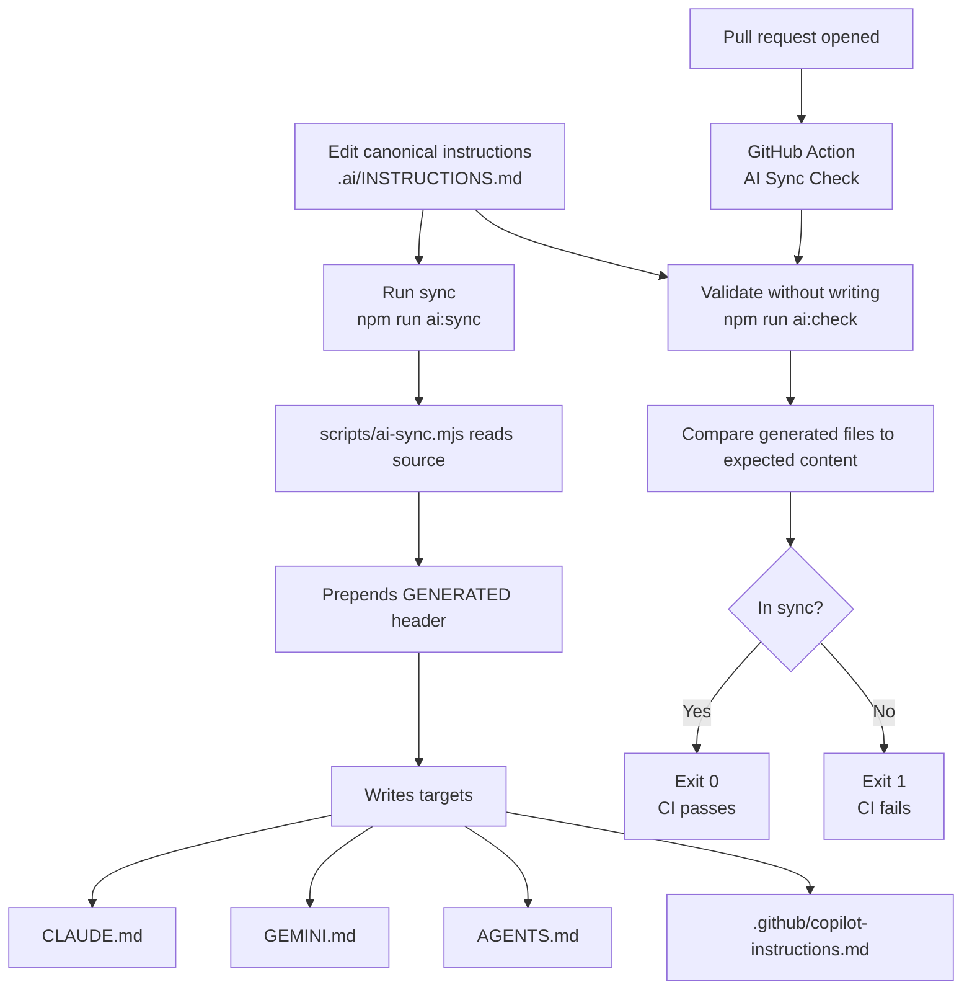

# AI CLI Memory Sync

One file to rule your AI instructions.

Keep your assistant guidance in one canonical place, then fan it out to the files each tool expects.

## TL;DR

1. Edit `.ai/INSTRUCTIONS.md`
2. Run `npm run ai:sync`
3. Commit generated files
4. Enforce with `npm run ai:check` in CI

## Why this exists

If you use multiple AI tools, instruction drift is almost guaranteed. This repo removes that drift by making one source of truth and generating the rest.

## Source of truth

- Canonical file: `.ai/INSTRUCTIONS.md`
- Sync script: `scripts/ai-sync.mjs`

Generated outputs:

| Tool | File |
|------|------|
| Claude | `CLAUDE.md` |
| Gemini | `GEMINI.md` |
| Codex/Agents (and Warp) | `AGENTS.md` |
| GitHub Copilot | `.github/copilot-instructions.md` |

## Quick start

```bash
npm install
npm run ai:sync
```

Check for drift (safe for CI):

```bash
npm run ai:check
```

Watch and auto-sync on source changes:

```bash
npm run ai:watch
```

Run tests:

```bash
npm test
```

## Everyday workflow

1. Update `.ai/INSTRUCTIONS.md`.
2. Run `npm run ai:sync`.
3. Review changes in generated files.
4. Commit everything together.

Important:
- Do not hand-edit generated files. They will be overwritten.

## How the flow works

Source file: `docs/flow.mmd`



## Automation options

Pre-commit with [Husky](https://typicode.github.io/husky/):

```bash
npm i -D husky
npx husky init
```

Suggested `.husky/pre-commit`:

```bash
#!/usr/bin/env sh
. "$(dirname -- "$0")/_/husky.sh"

npm run ai:sync
git add CLAUDE.md GEMINI.md AGENTS.md .github/copilot-instructions.md
```

PR safety net:
- GitHub Actions workflow: `.github/workflows/ai-sync-check.yml`
- Runs `npm install` and `npm run ai:check` on pull requests

## Goals

- Keep a single canonical instructions file
- Generate tool-specific files predictably
- Make drift obvious in local dev and CI

## Non-goals

- Calling AI CLIs directly
- Supporting every possible tool convention
